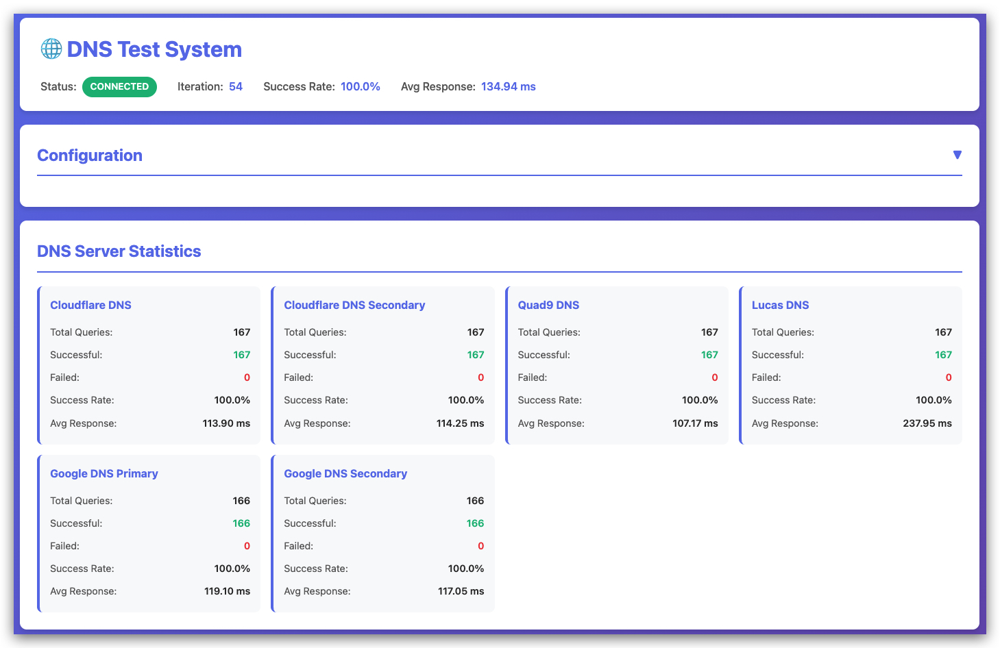

# DNS Test System

A comprehensive DNS testing system with real-time web monitoring, built with Python, FastAPI, and Docker. Continuously tests multiple domains against multiple DNS servers with WebSocket-powered live updates and structured JSONL logging.



## Features

- **Continuous Testing**: Automated DNS resolution tests running at configurable intervals
- **Real-time Monitoring**: Live WebSocket updates to web dashboard
- **Multiple DNS Servers**: Test against any number of DNS servers simultaneously
- **Comprehensive Logging**: Structured JSONL logs with automatic rotation
- **Performance Metrics**: Response time tracking and success rate statistics
- **Interactive Dashboard**: Modern web UI with charts and real-time results
- **Docker Ready**: Fully containerized with docker-compose support
- **Configurable**: YAML configuration with environment variable overrides
- **Robust**: Automatic error handling and reconnection logic

## Quick Start

### Prerequisites

- Docker and Docker Compose
- Port 8900 available (configurable)

### Installation

1. Clone or download this repository:
```bash
cd docker-dns-test
```

2. Create configuration file:
```bash
cp config.yaml.example config.yaml
```

3. Edit `config.yaml` to customize domains and DNS servers:
```bash
nano config.yaml
```

4. Build and start the container:
```bash
docker-compose up -d
```

5. Access the web dashboard:
```
http://localhost:8900
```

## Configuration

### config.yaml

The main configuration file uses YAML format. See `config.yaml.example` for a complete example.

#### DNS Servers
```yaml
dns_servers:
  - name: "Google DNS Primary"
    ip: "8.8.8.8"
    port: 53
  - name: "Cloudflare DNS"
    ip: "1.1.1.1"
    port: 53
```

#### Domains to Test
```yaml
domains:
  - "google.com"
  - "github.com"
  - "stackoverflow.com"
```

#### Testing Parameters
```yaml
testing:
  interval_seconds: 5      # Time between test iterations
  timeout_seconds: 3       # Timeout for each DNS query
  max_concurrent_queries: 10  # Max parallel queries
```

#### Logging
```yaml
logging:
  enabled: true
  file_path: "/app/logs/dns_results.jsonl"
  max_file_size_mb: 100
  rotation_count: 5
```

### Environment Variables

You can override configuration values using environment variables:

```bash
DNS_TEST_INTERVAL=10 \
DNS_TEST_TIMEOUT=5 \
LOG_ENABLED=true \
docker-compose up -d
```

Available environment variables:
- `DNS_TEST_INTERVAL` - Override test interval
- `DNS_TEST_TIMEOUT` - Override query timeout
- `DNS_MAX_CONCURRENT` - Override max concurrent queries
- `LOG_ENABLED` - Enable/disable logging
- `LOG_FILE_PATH` - Override log file path
- `WEB_HOST` - Override web host
- `WEB_PORT` - Override web port
- `HOST_PORT` - Host port to expose (default: 8900)

## Usage

### Docker Compose Commands

Start the system:
```bash
docker-compose up -d
```

View logs:
```bash
docker-compose logs -f
```

Stop the system:
```bash
docker-compose down
```

Restart after configuration change:
```bash
docker-compose restart
```

Rebuild after code changes:
```bash
docker-compose up -d --build
```

### Web Interface

Access the dashboard at `http://localhost:8900`

Features:
- Real-time test results table
- Success rate and response time statistics
- Charts showing performance by DNS server
- Filter to show only failures
- Configuration display
- Connection status indicator

### API Endpoints

The system provides REST API endpoints:

- `GET /` - Web dashboard
- `GET /health` - Health check
- `GET /api/status` - System status and statistics
- `GET /api/config` - Current configuration
- `GET /api/results?limit=100` - Recent results
- `GET /api/logs?lines=100` - Recent log entries
- `WebSocket /ws` - Real-time updates

Example API usage:
```bash
# Get system status
curl http://localhost:8900/api/status

# Get recent results
curl http://localhost:8900/api/results?limit=50

# Get configuration
curl http://localhost:8900/api/config
```

## Log Analysis

Logs are written in JSONL format (one JSON object per line) for easy parsing.

### Example Log Entry
```json
{
  "timestamp": "2026-01-29T10:30:45.123Z",
  "iteration": 42,
  "domain": "google.com",
  "dns_server": {
    "name": "Google DNS",
    "ip": "8.8.8.8",
    "port": 53
  },
  "success": true,
  "response_time_ms": 23.4,
  "resolved_ips": ["142.250.185.46"],
  "error": null
}
```

### Analyzing Logs with jq

View all failures:
```bash
cat logs/dns_results.jsonl | jq 'select(.success == false)'
```

Calculate average response time by DNS server:
```bash
cat logs/dns_results.jsonl | jq -s '
  group_by(.dns_server.name) |
  map({
    server: .[0].dns_server.name,
    avg_ms: (map(select(.response_time_ms != null).response_time_ms) | add / length)
  })
'
```

Find slowest queries:
```bash
cat logs/dns_results.jsonl | jq -s 'sort_by(.response_time_ms) | reverse | .[0:10]'
```

Count errors by type:
```bash
cat logs/dns_results.jsonl | jq -s 'group_by(.error) | map({error: .[0].error, count: length})'
```

Success rate by domain:
```bash
cat logs/dns_results.jsonl | jq -s '
  group_by(.domain) |
  map({
    domain: .[0].domain,
    total: length,
    successful: (map(select(.success)) | length),
    success_rate: ((map(select(.success)) | length) / length * 100)
  })
'
```

## Architecture

### Components

1. **DNS Resolver** (`app/core/dns_resolver.py`)
   - Async DNS queries using dnspython
   - Concurrent query execution with semaphore
   - Timeout and error handling

2. **Test Engine** (`app/core/test_engine.py`)
   - Main loop orchestration
   - Circular buffer for results
   - Statistics calculation
   - Callback system for broadcasting

3. **Logger** (`app/core/logger.py`)
   - Async JSONL logging
   - Automatic file rotation
   - Configurable size limits

4. **WebSocket Manager** (`app/api/websocket.py`)
   - Connection management
   - Broadcast mechanism
   - Auto-cleanup of dead connections

5. **Frontend** (`app/static/`)
   - Real-time WebSocket client
   - Chart.js visualizations
   - Auto-reconnect with exponential backoff

### Data Flow

```
Test Engine Loop
    ↓
DNS Resolver (batch queries)
    ↓
Results → [Buffer, WebSocket, Logger]
    ↓
WebSocket → Frontend → Charts/Tables
    ↓
Logger → JSONL files
```

## Performance Tuning

### Recommended Settings

| Scenario | Domains | DNS Servers | Interval | Max Concurrent | Memory |
|----------|---------|-------------|----------|----------------|--------|
| Small    | 5-10    | 2-4         | 5s       | 10             | 256MB  |
| Medium   | 20-50   | 4-8         | 10s      | 30             | 512MB  |
| Large    | 100-200 | 8-15        | 30s      | 100            | 1GB    |

### Docker Resource Limits

Adjust in `docker-compose.yml`:

```yaml
deploy:
  resources:
    limits:
      cpus: '1.0'
      memory: 512M
    reservations:
      cpus: '0.25'
      memory: 128M
```

## Troubleshooting

### Container won't start

Check logs:
```bash
docker-compose logs dns-tester
```

Common issues:
- Port 8900 already in use: Change `HOST_PORT` environment variable
- Invalid config.yaml: Check YAML syntax
- Missing config.yaml: Copy from config.yaml.example

### No results appearing

1. Check if test engine is running:
```bash
curl http://localhost:8900/health
```

2. Check WebSocket connection in browser console
3. Verify domains and DNS servers in config.yaml
4. Check Docker container logs

### High memory usage

- Reduce `history_buffer_size` in config.yaml
- Decrease number of domains or DNS servers
- Increase `interval_seconds` to reduce query rate

### DNS queries timing out

- Increase `timeout_seconds` in config.yaml
- Check network connectivity from container:
```bash
docker exec dns-tester ping 8.8.8.8
```
- Verify DNS servers are reachable

## Development

### Project Structure

```
docker-dns-test/
├── app/
│   ├── core/           # Core functionality
│   ├── api/            # FastAPI routes and WebSocket
│   ├── static/         # Frontend files
│   ├── config.py       # Configuration management
│   ├── models.py       # Pydantic models
│   └── main.py         # FastAPI application
├── logs/               # Log files
├── Dockerfile          # Container definition
├── docker-compose.yml  # Orchestration
├── config.yaml.example # Configuration template
└── requirements.txt    # Python dependencies
```

### Running Without Docker

1. Create virtual environment:
```bash
python3 -m venv venv
source venv/bin/activate
```

2. Install dependencies:
```bash
pip install -r requirements.txt
```

3. Create config.yaml:
```bash
cp config.yaml.example config.yaml
```

4. Run the application:
```bash
uvicorn app.main:app --host 0.0.0.0 --port 8900 --reload
```

## License

This project is provided as-is for educational and testing purposes.

## Contributing

Contributions welcome! Areas for improvement:
- Additional DNS record types (AAAA, MX, TXT, etc.)
- Alerting system for failures
- Historical data persistence
- Comparison views
- Export functionality
- Mobile-responsive improvements

## Support

For issues or questions:
1. Check the troubleshooting section
2. Review Docker logs
3. Verify configuration syntax
4. Test DNS connectivity manually

## Version History

- **1.0.0** (2026-01-29)
  - Initial release
  - Real-time DNS testing
  - WebSocket dashboard
  - JSONL logging
  - Docker support
